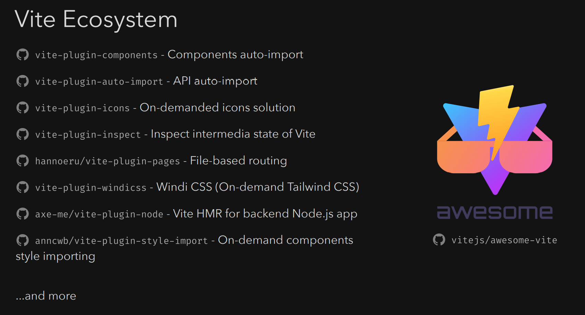

# {{ $frontmatter.title }}

<!-- 时间从 2021-10-22 ~ 2021-10-30 -->
<!-- 定位大前端、web开发、数码科技、动漫 -->

宣传自家节目
::: tip 《Web Worker》播客

本周我们更新了《Web Worker》第 3 期《我们想挖新坑：评测网页》。

我们有个新想法，想搞一个新节目来满足主播的观点输出：那就是评测网页！（在一个节目里讨论另一个节目怎么做也是没谁了。）本次邀请到了前同事林鑫参与讨论。评测网页是什么意思？想知道主播在想什么的话，[点击链接我们听起来吧！](https://www.xiaoyuzhoufm.com/episodes/617b8b45c890259cb983e27d)
:::

## :wrench: 技巧

- 在 vscode 中把 `code` 注册到环境变量之后，可以使用 `code .` 在新窗口打开当前路径，使用 `code -r .` 可以在当前编辑器打开。

## :link: 工具和链接

如果你想找 pnpm + monorepo 的 demo，可以看这个。

https://github.com/AngelMunoz/monosample

ThreeJS + VueJS 3 + ViteJS 技术组合

https://troisjs.github.io/

一个库，彻底释放你对浏览器光标的想象力

https://github.com/gmrchk/blobity

小伙伴发现 vivo x70proplus 手机的专题页非常炫酷。

https://www.vivo.com.cn/vivo/x70proplus/

炫酷的 3D 房间，基于 webGL

https://my-room-in-3d.vercel.app/

炫酷的小车，可以控制和浏览世界，好像和上面是同一个作者

https://bruno-simon.com/

刘威的富文本编辑首选

https://codex.so/editor

## :fire: 快讯

antfu 在 Vue.js London 2021 的演讲 ppt 《[New Ways to Vue](https://github.com/antfu/talks/tree/master/2021-10-20)》 中提到了 vite 中有意思的插件。

https://github.com/antfu/talks/tree/master/2021-10-20

GMTC 2021 深圳场会在 11/09 举办，又将是一场下半年的前端盛宴。上半年字节在 GMTC 北京诠释了内部的前端工作流。不知道这次会有什么新变化。现在公开了部分日程安排。

https://gmtc.infoq.cn/2021/shenzhen/track

尤雨溪在国内的早早聊前端大会做了分享《One Year Into Vue3》，回顾了一年来 vue3/vite 的变化，介绍了一些最佳实践，对未来也做了一些展望。

提到的录播和 ppt ，目前需要联系小助手 `Eva_melon` 参与活动来免费开通。

又一次 npm 安全事故:这次是 [ua-parser-js](https://github.com/faisalman/ua-parser-js)，npm 的安全长期看会是一个长久的顽疾。

https://github.com/faisalman/ua-parser-js/issues/536

字节里的抖音开源了一个 `Semi Design`，给自己的定位是：“包含设计语言、React 组件、主题等开箱即用的中后台解决方案”。不过有人指出内部代码中有竞品源码的影子，对此[官方致歉](https://github.com/DouyinFE/semi-design/issues/70)。质量如何交给时间来判断。

http://semi.design/zh-CN

本周字节在 [稀土开发者大会 2021](https://live.juejin.cn/site/4354/xdc2021?utm_source=juejinweb) 上开源了一个组件库 `Arco Design`，定位是“全面开源的企业级产品设计系统”。同时支持 React 和 Vue3。不过有人指出内部代码中有竞品源码的影子，对此[官方致歉](https://github.com/arco-design/arco-design/pull/12)。质量如何交给时间来判断。

https://arco.design/

本周字节在 [稀土开发者大会 2021](https://live.juejin.cn/site/4354/xdc2021?utm_source=juejinweb) 上开源了 `Modern.js`，定位是“现代 Web 工程体系”，回应了上半年 GMTC 大会预告的内容。质量如何交给时间来判断。对于上述三项内容，我和刘威后续会开一期播客来解析细节，敬请期待。

https://modernjs.dev/

本周另一个大新闻：《Facebook 改名“Meta”，这是要押注元宇宙了？》

https://www.163.com/dy/article/GNI24CAM0517AGGF.html

## :bulb: 共读

React 的新文档上线了部分内容，可以访问 https://beta.reactjs.org 来预览。同时负责官方中文文档的**印记中文**也随之启动，并且在同名公众号（印记中文）里从文档角度提到了一些变化。[聊聊 React 新文档](https://mp.weixin.qq.com/s/f04RrFSojBR8lJOnvAALmg)

https://mp.weixin.qq.com/s/f04RrFSojBR8lJOnvAALmg

本周我去 [崔大的直播间](https://space.bilibili.com/175301983) 踢馆，分享了一波 Github Actions 的科普和延伸玩法，但一激动没录屏，只能看看文档了。

https://www.yuque.com/xinbao37/fe-tools/github-actions

## :microphone: 朋友说

- 本周北京有疫情，疫苗第三针可以准备了。
- 部分城市打通了全国范围内的公积金贷款，可真是“北京挣钱也能回家花”。
- 群里很多小伙伴提到了 pnpm 来称为主力工具，或许你也可以尝试一下。
- 本周有 1024，有些公司关怀了程序员们。
- 本周石头安利了 B 站 UP 主 [星球研究所](https://space.bilibili.com/326427334)，地理迷的臻爱。
- 本周石头和刘威讨论了一波动态换肤，我已经说服石头后面做自定义换肤的分享了，大家后续等待。
- 本周我们搜集了接近 30 个和 web 样式、主题有关的问题，后续可以做一次分享。
- MacOS 12 Monterey 可以升级了。
- 前同事少华老家镇上[挖出了特大型金矿](https://view.inews.qq.com/a/20211030A03VUE00)。
