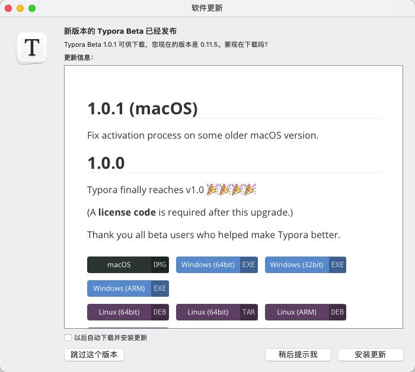
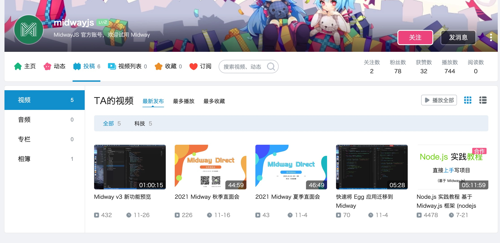
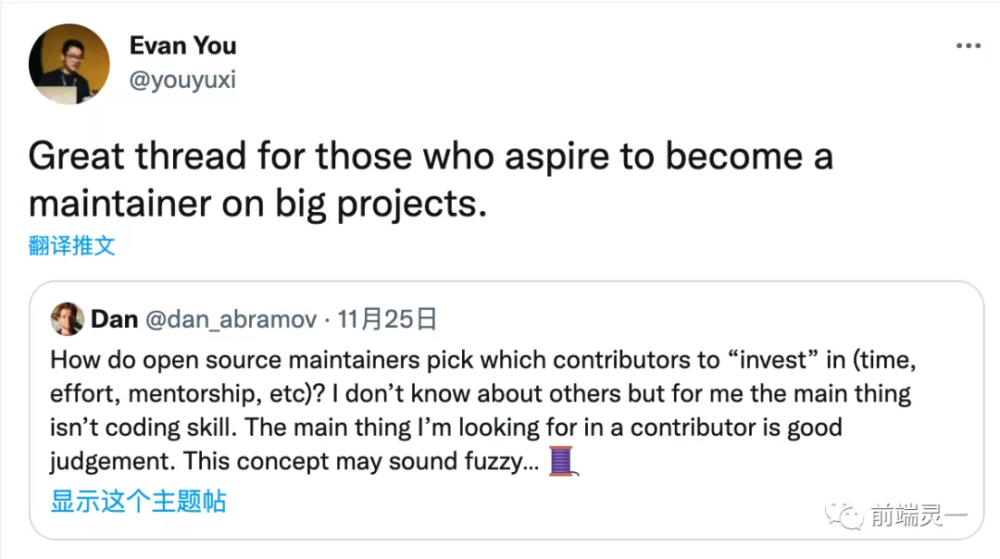

# {{ $frontmatter.title }}

宣传自家节目
::: tip 《Web Worker》播客预告

Web Worker 播客新一期有谱了，邀请到了神秘嘉宾，前端开源大佬。明天后天会正式放出节目预告，敬请期待！
:::

## 🔧 技巧

- **[vueUse 里的虚拟列表](https://vueuse.org/core/useVirtualList/)** - `vueUse` 提供了一个虚拟列表，我看了直拍大腿，早知道不重复造轮子了。开箱即用，真好真好。

## 🔗 工具和链接

- **[腾讯会议：网络研讨会 Webinar](https://meeting.tencent.com/webinar.html)** - 腾讯会议搞了个新模式，明显让会议交流更有专业性了，主持人、嘉宾、观众，下次 web worker 播客可以搞搞。

- **[alibaba/formily v2 发布](https://github.com/alibaba/formily)** - 多次 beta/rc 之后终于 release 了，阿里出的统一的表单解决方案，应该可以对这个工具出一期教程，兼容 react/vue2/vue3

- **[typora v1.0 release 也收费了](https://typora.io/)** - 一代神器 typora 正式发布 1.0 了，当然好用的东西也是有成本的，正式版开始要求授权购买了，89 元人民币买断三台设备授权，倒是不贵，买断好评！后面肯定会加入更多功能的。

## 🔥 快讯

- **[Remix 框架正式开源，Next.js 迎来新挑战](https://mp.weixin.qq.com/s/4tyokphSgDo_7Qh9Uf82kQ)** - 仰望高端玩家入局，不知道是否有机会在工作中用上。

- **[「VERSE」中文名称等你来定！大象包你 99 年](https://mp.weixin.qq.com/s/pEgUESSul_ZOsCmChUvQ_Q)** - 印象笔记的技术团队原来还活着，这次要推一个新产品，作为曾经的印象大使发布之后关注下。

- **[Midway v3 新功能预览](https://www.bilibili.com/video/BV1aL4y1p7oA?p=1&share_medium=iphone&share_plat=ios&share_session_id=37333580-6201-495D-9C14-567F2DF229AE&share_source=WEIXIN_MONMENT&share_tag=s_i&timestamp=1638074274&unique_k=OHj5BAL)** - `midway` 在使用视频传播这一块做的很好，一直坚持，这才是运营自己产品应该有的认真样子。

## 💡 共读

- **[【译】开源维护者选择项目 maintainer，最看重的其实不是编码技能](https://mp.weixin.qq.com/s/lMFmoI9rXKPNwU1Em4FgBA)** - 开源项目需要社区的支持，也需要选择合适的共建者 maintainer？这篇文章给出了一些建议，也反向鞭策自己，如果参与开源、参与社区运营的角度，可以做哪些事情，可以把事情往好的方向发展？

- **[前端智能化助力大促会场开发提效 48% - 京东零售技术](https://mp.weixin.qq.com/s/5IKqy404OX8GdxttNHq6ow)** - toC 有大量专题页，`low code` 做基础页面已经不需要再提，但打通链路，从设计师直接上传、ai 训练组件库、组件沉淀上，有一套完整的功能，这一点就体现到了技术实力。

- **[如何起草一份通俗易懂的 SOP？【标杆精益】](https://mp.weixin.qq.com/s/NDouy-O5NKs4OA3Yxw9zIA)** - `SOP` Standard Operation Procedure 标准作业程序。产品交付、团队建设、新人导引用得上 。

## 🐟 摸鱼

- **[在 GitHub 学习，成长为自己想要的样子｜ HelloGitHub 访谈 - iamkun（朱昆）](https://mp.weixin.qq.com/s/8DVYkezqZ7KbSzP7cQgFsQ)** - 别人的做访谈。采访了 iamkun（朱昆）是 day.js/element/element-plus 的负责人，角度有个人精力、开源项目、开源心路历程、个人提高等。内容量很大，iamkun 个人魅力很强，我在 element-plus 中能感受到这一点，后续我也可以做一个专访节目。

- **[苹果官网中这个一闪而过的动画，真高端！用 PPT 肝它...](https://mp.weixin.qq.com/s/qvzeEuDD4hvjbgAjTUMbgA)** - 旁门左道 PPT 写的复刻官网效果，实操性强，另一个角度看，也是评测网页的好方法。

- **[飞哥：十年光阴如梭](https://mp.weixin.qq.com/s/FofbTi-uZKgnlX1PSTmNWA)** - 看一个 10+年的程序员回顾他的成长史，如何工作中 push，如何自我提升。

- **[格物·革悟 - AntV 2021 年度发布](https://mp.weixin.qq.com/s/iH9TNphxEqXp6-A2f7dBZw)** - 可视化团队天花板：“今年在图可视分析领域，我们孵化了「GraphInsight」平台。在地理可视分析领域，我们开源了 「DipperMap」 工具。在智能可视分析领域，上线了 AVA 2.0 「LiteInsight」 模块，AntV 的第五个品牌日，我们将继续探索数据分析的技术与产品的解决方案。”

## 🎤 朋友说

- **新一期播客有谱了** 这次邀请到了神秘嘉宾，前端开源大佬。预计明天后天会正式放出节目预告，敬请期待！
- **长期投稿：限定介绍程序员的桌面**。可以顺手发起一个长期投稿，放程序员们的工作、在家的工作桌面。这是一个很好的拉进距离的话题。
- **[别人晒的掘金周边](https://juejin.cn/pin/7031879146242310174)** - 看别人分享了自己手机的掘金周边，这样让我思考，如果 web worker 也出周边，可以做成什么样，期待未来。
